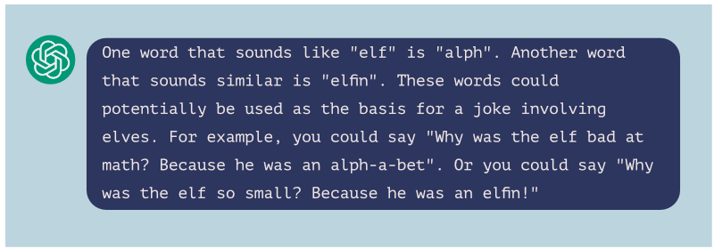

# Can I teach AI to make Cracker Jokes?

Christmas Cracker jokes are an example of puns or Dad jokes that are a very popular type of comedy -- especially when you make them up spontaneously. 

As well as working in AI and Data Science, I am an improv comedian and make up puns and jokes on the spot on stage using audience suggestions. I asked my colleague Fede Nanni who is an expert in Natural Language Processing (NLP) and my improv troupe The Oxford Imps to help me with teaching ChatGPT to make jokes.

## What is ChatGPT?

ChatGPT, released for preview just last week by OpenAI, is a Natural Language Processing (NLP) model and AI which makes text in a way that seems very human.

ChatGPT is an extension of GPT-3, the largest language model ever created and it has learnt from millions of examples of human text and in a variety of styles. It interacts like a chatbot and can create stories, poems, songs, and intelligent responses to questions.

People are extremely excited by ChatGPT and GPT-3 because it is often close to passing the Turing test. I can ask ChatGPT to explain for us the Turing test:


ChatGPT is extremely impressive when you ask it to generate new text:


We can use Cracker Jokes to test ChatGPT's ability to generate text that is similar to human text, and to explore what is so human about puns!

## Does ChatGPT know any Christmas Cracker jokes?


If you ask ChatGPT for Christmas Cracker style jokes, it is immediately able to give a few good examples, for instance:


Most of these look great! The ability for it to tell jokes like this was beyond the scope of AI until very recently. However, I think I have heard one of those before. We can ask ChatGPT whether these are original jokes, and it is admits they are "well known examples":


ChatGPT was trained on huge datasets of human text, and so while it is impressive, the AI is copying jokes it has heard before and relaying them. This is like a child repeating a joke they have heard from their parents.

Something lots of people have noticed is that ChatGPT is often very confidently incorrect, where it can justify why a joke is funny and yet is completely wrong:


Most of the time, when you ask it to explain a good joke it has just told you, it misses the mark entirely. We don't have access to ChatGPT's training data, but it doesn't look like it is creating jokes.

## Can ChatGPT make new jokes?

With a more specific topic, ChatGPT tries to make new jokes:


However, these are funny but they are not jokes. Comedians would call these **anti jokes**. 

Here is a human example of an anti-joke:

`Why did the penguin miss the party?`

`Because it was dead.`

This is funny because you're expecting a joke punchline and instead it is dark and abrupt.  ChatGPT is able to make anti jokes accidentally by producing nonsense sentences, which is why we laugh at its responses. However, it is more like we're laughing at the AI rather than with it.

ChatGPT has copied the pattern of a joke and kept the context of a Christmas tree, but it is not able to create a real punchline. 

We can also see ChatGPT is behaving like a small child, who also learn the pattern of jokes but cannot make a joke:


I often teach new improv performers to make up puns on the spot so I can try and teach ChatGPT using the same method. 

## How Improvise A Pun

**Step 01** Take your suggestion/keyword (`turkey`)

**Step 02** Find words that sound like your keyword (`Torquay`)

**Step 03** Create a sentence that replaces your keyword with your similar word (`I had a Torquay dinner`)

**Step 04** Create a set up sentence with words that are associated to both your keyword and your similar word (`turkey` = `Christmassy` and `Torquay` = `Devon`)

**Step 05** Put it all together:
```
Why was I feeling Christmassy in Devon?
I had a Torquay dinner!
```


## Can we teach ChatGPT to make new jokes?

ChatGPT can learn new information and tasks within a single session, so you can ask it to do something new and it will try to do it.





One of the first major problems is that ChatGPT cannot struggles with the concept of words "sounding like" other words. For example with `turkey` it suggests `turquoise` and `turmeric` sound similar.

So I will help it out with this step.


As ChatGPT learns within a session, it is able to learn from its mistakes and improve. I can also give it positive feedback and hope it can learn to make a new joke:


## How Human are these Jokes?

Now to compare ChatGPT to human performance. It is not fair to compare these jokes compared with well known jokes, especially as people may recognise them. 

Instead we need improvised jokes from humans, and so I made some up along with other improvisers from [The Oxford Imps](theoxfordimps.com). 

We created a quiz for people to guess whether a joke was created by a human or by ChatGPT. We tested ChatGPT's original jokes and those it made with coaching against human jokes.

## Human vs AI Humour

Here are the results:

Firstly we found it was clear ChatGPT's improvised jokes do not pass the Turing Test. However, when it was coached to make "word replacement" puns some of its examples were just as good as a human improviser. Finally, human jokes with "dual meaning" are easier to spot as human. 

So it is possible for ChatGPT to make puns that sound human, but it still requires some help!

## Very Human Puns

The humans make **word replacement** puns on the spot, but they are also able to make **dual meaning** puns.

Here are some well known examples:

```
Why did no one buy Rudolph or Blitzen on eBay?
Because they were two deer.
```

```
Why didn't the Christmas tree leave the forest?
It was too attached to its roots.
```

The punchline is a sentence with two meanings, unlike word replacement puns which are much simpler. I tried to get ChatGPT to try it out:


## Dehumanisation

An interesting result is that one of the jokes was consistently rated as being from ChatGPT, even though it was a human joke.

This was one of ***my jokes***, and so it seems having spent the last few weeks teaching GPT-3 and ChatGPT, they have also taught me to make jokes that sound like AI.

Another one of my jokes was voted the most human, so I haven't completely lost my humanity (yet).

## Conclusion and Final word from ChatGPT

As we can see, there were successes between AI when it collaborates with a human. This is becoming more common in the field of AI, where humans and AI work together to create new things.

Now I will let ChatGPT conclude this article:


> In conclusion, while AI is capable of generating puns and jokes, it is still limited in its ability to create original and clever humor. In many cases, AI simply repeats jokes it has heard before rather than coming up with new ones. When asked to create jokes on a more specific topic, it produces "anti-jokes," which are funny because they are nonsense rather than because they are clever. On the other hand, humans are able to use their advanced language skills and understanding of wordplay to create original and funny jokes. This shows that while AI has made progress in this area, there is still a long way to go before it can match the creativity and humor of humans.


## Acknowledgements

The authors Lydia France and Fede Nanni want to thank The Oxford Imps for their puns, Giacomo Nanni and Anne Lauscher for helping with brainstorming ideas around the use of GPT-3 for this purpose and especially our comedian friend ChatGPT itself for having entertained us for a couple of weeks and for writing parts of the article. 
